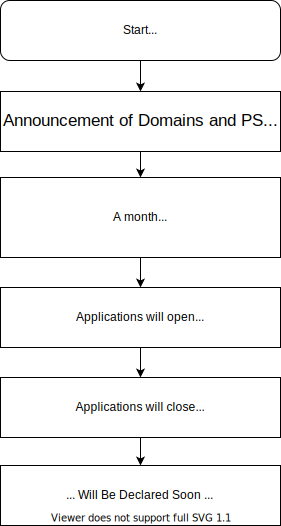

# Unicode Project Week

Hello Everyone! This is the official repository for the First Unicode Project Week. This contains all documents related to procedures, rules, timeline etc. and will be where the results are declared. Star and watch this, if you want to stay updated!

### What is this about

This is an event, introduced by Unicode, with focus on **_Celebration of Learning_**.

The main goals of this event are to:

- Encourage exploration of unconventional and new domains, stacks etc.
- Give equal, if not more, importance to the sustainable and maintainable coding practices explicitly.
- Have clarity and maximum transparency regarding decisions and results.
- Celebrate learning, rather than just focusing on the outcome.
- Help people make projects and learn new things.

## Rough Timeline

## TL;DR of Details

This section gives short version of various documents in this repository. **Note** that even though this does highlight the main points, please get at least one team member to go through the detailed documents, as those explain the points in much more detail, including edge cases.

### Selection criteria

For selecting a team various criteria will be used, and all scores given for all teams will be made open in this repository after the selection.

Selection application will be taken on Devfolio, with team size of **3-5** students. Inter-departmental teams can be made, but SEs and TEs must make separate teams. Along with basic information such as names and SAP IDs, link to 3 github repositories and **1-3** PS(s) will also be taken, which will be used to evaluate the team for selection.
For PS :

- Exploration of new and unconventional domains is encouraged and common and usually selected domains will be given a slightly lower preference.
- Thus, if you take an unconventional domain from the listed domains, there will be a good chance of a team getting selected, subject to other selection criteria.
- For SEs, even though we really want to encourage exploration of domains which we have not listed, we might not be able to guide the teams posting PS in them. But if a mentor is ready, and wants to explore the domain, your PS might be given higher preference over others.

The evaluation of teams will be done on following points :

- Clean coding and good coding practices
  - File structure
  - Naming conventions
  - Comments
  - Indentation and code formatting
  - Code organization
  - Domain specific conventions
  - Documentation
- GitHub commit history
  - Regularity of commits
  - Proper commit messages
  - Sensible commit size
- Readme documentation
  - Explanation of the project
  - User Documentation
  - Setup instructions
  - Project Images
  - Code snippets showing usage
  - License
  - Only valid and relevant information
